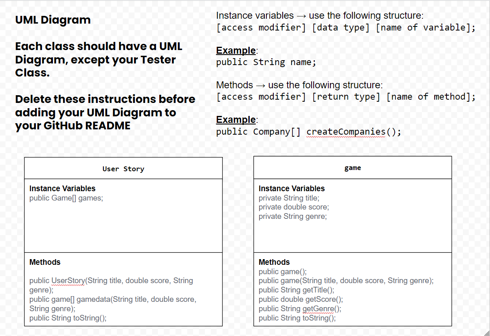

# Data-for-Social-Good-Project
# Unit 3 - Data for Social Good Project 

## Introduction 

Software engineers develop programs to work with data and provide information to a user. Each user has different needs based on the information they are looking for from data. Your goal is to create a data analysis program for your user that stores and analyzes data to provide the information they need. 

## Requirements 

Use your knowledge of object-oriented programming, one-dimensional (1D) arrays, and algorithms to create your data analysis program: 
- **Write a class** – Write a class to represent your user or business and store and analyze their data with no-argument and parameterized constructors. 
- **Create at least two 1D arrays** – Create at least two 1D arrays to store the data that your user needs information about. 
- **Write a method** – Write a method that finds or manipulates the elements in a 1D array to provide the information your user needs. 
- **Implement a toString() method** – Write a toString() method that returns general information about the data (for example, number of values in the dataset). 
- **Document your code** – Use comments to explain the purpose of the methods and code segments and note any preconditions and postconditions. 

## User Story 

Include your User Story you analyzed for your project here. Your User Story should have the following format: 

> As an [Manager at a video game distributer],   
> I want to [help people find good games based on their preferred genre],   
> so that I can [easily recommend good games for my customers based on what they like]. 

## Dataset 

Include a hyperlink to the source of your dataset used for this project. Additionally, provide a short description of each column used from the dataset, and the data type. 

Example: 
 
Dataset: https://www.kaggle.com/datasets/kapturovalexander/ign-games-from-best-to-worst 
- **Title** (String) - name of the game 
- **Score** (double) - The score that was given by IGN out of ten 
- **Genre** (String) - The genre of the Game 

## UML Diagram 

## Description 

 In our project our user story is that I am a manager at a video game distributing company. We wanted it to be easy for our cutomers to find games based on genre's they like. This cuts down on time looking for a good game to play and leaves a good chance the customer would like the game they purchased if they picked a genre they already like. Our code creates a game object with a title, score, and genre taken from our text files. The main method that the customer would use is our getGameGenre method which iterates through the text files and returns a list game with the same genre the customer wants with the game's title, score and its genre. 